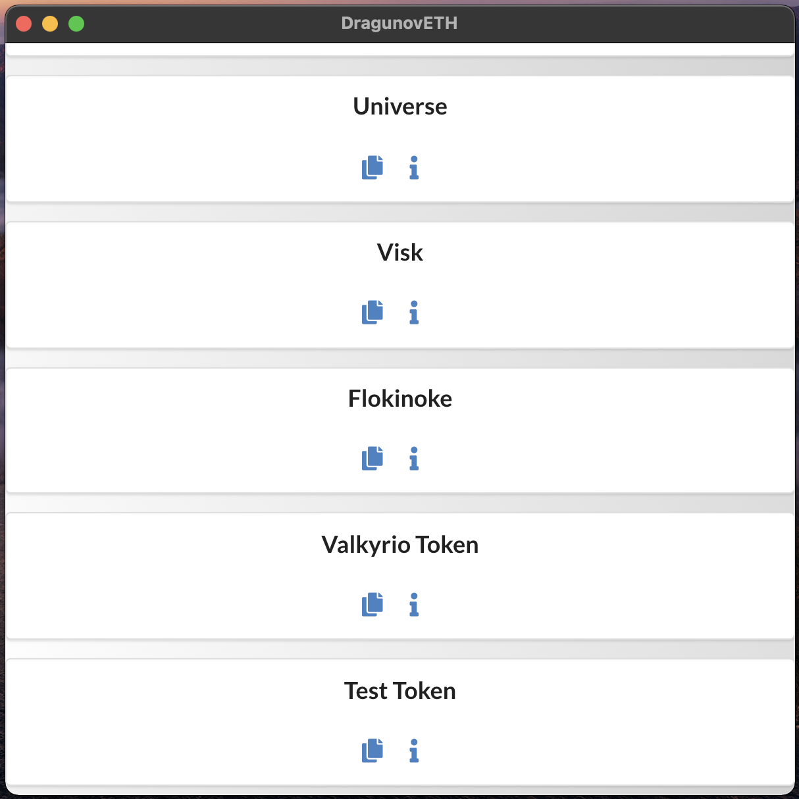
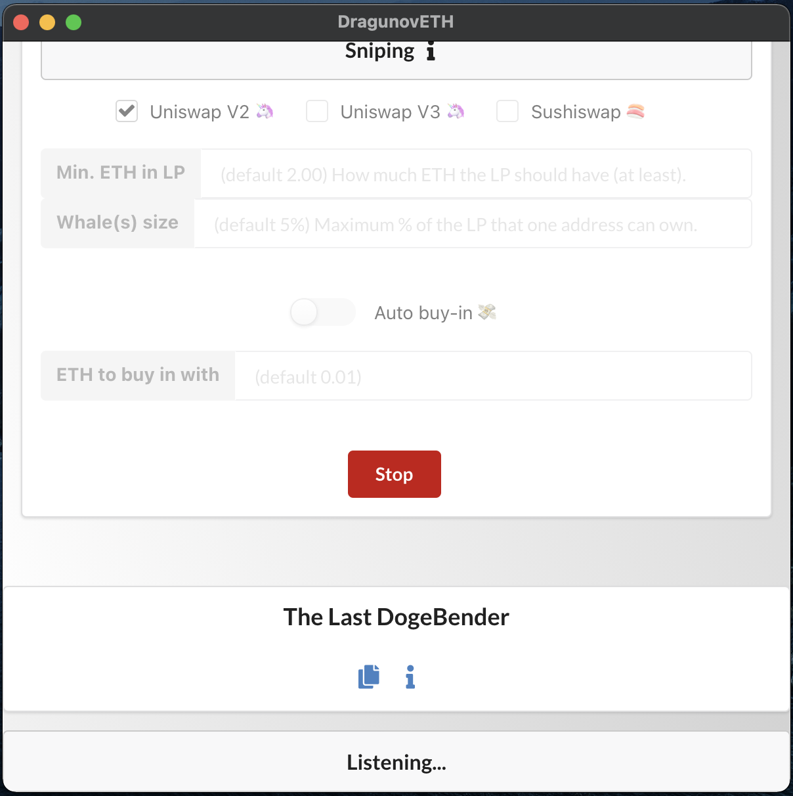
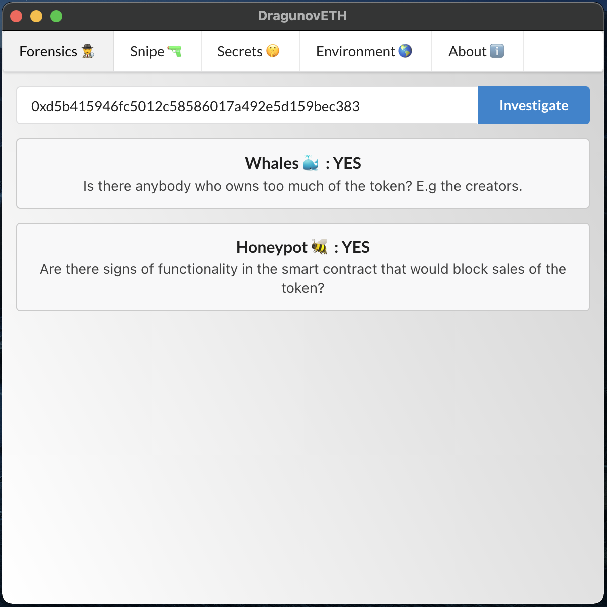
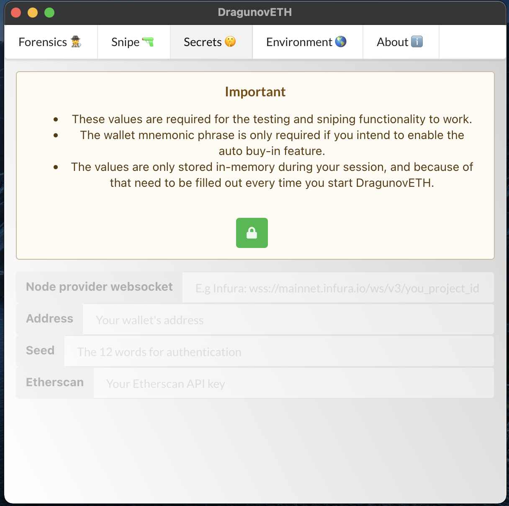
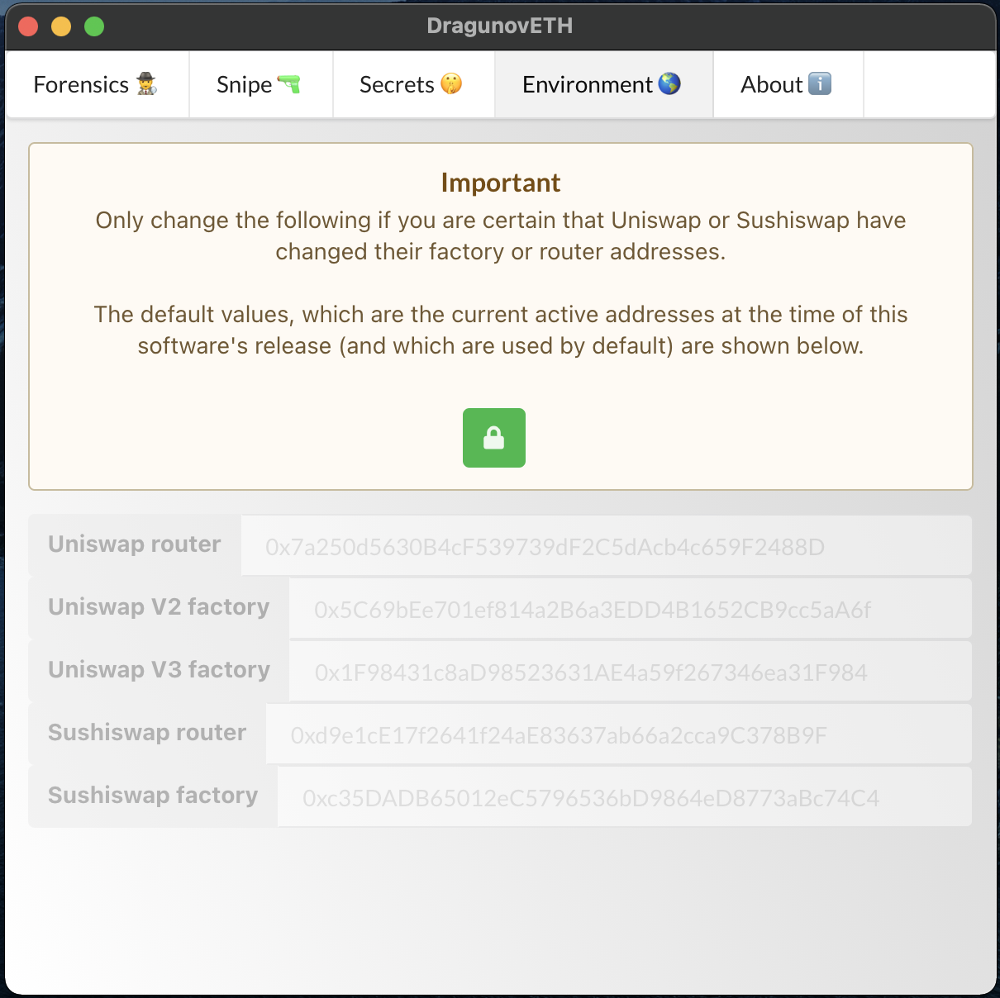
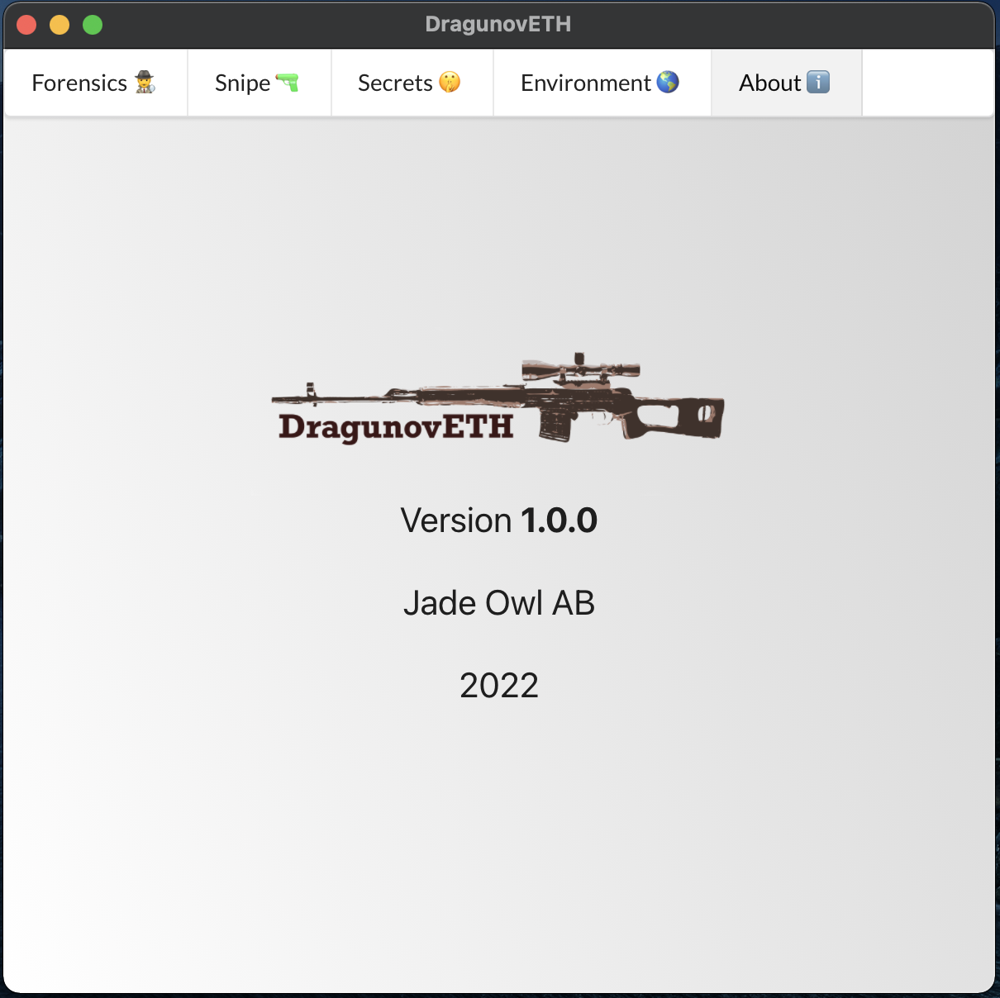

## Description

DragunovETH is a liquidity pool sniping bot and safety tool for inspecting ERC20s.

A "sniper" in crypto space is a bot that detects the creation of a liquidity pool for a pair of tokens and allows you to buy in early, making you a whale. When the ticker for the pair goes up, you can sell off, netting you a good profit.

This is equivalent to an early mover advantage in the stock market or similar securities.

⚠️ Sniping LPs can be a risky and complicated endeavour.

😌 DragunovETH has an array of functions to make buying early into a promising token's LP easy and safe.

💎 Currently supports Ethereum DEXes - Uniswap (v2 and v3) 🦄 and Sushiswap 🍣. Binance is dominated by scam-coins.

🕵️‍♂️ One of the features is the ability to simply paste a token address and run tests on the liquidity, holders' position sizes and source code.

🤖 The other is subscribing to liquidity protocol factories with extensive options.

💸 You can select which criteria the newly created LP must pass to be considered of interest. If so inclined, you can even let the bot enter a position on your behalf.

🌎 Cross-platform - runs on MacOS and Linux, with Windows coming soon.

🛡 Secure - DragunovETH does not store any information locally or remotely. Every time you start the software, you have to enter your credentials.

## Setup

To allow DragunovETH to test tokens for malicious code or whales, and to enter positions on your behalf, you will need to enter some credentials every time you start the software. All of these are to be entered in the "Secrets" tab.

You will need a node provider with a websockets connection, such as Infura . You can create a free account and project there, and paste the ws url in our application. Any provider of your choice's websockets url would work too, but we recommend Infura for simplicity's sake.

An Etherscan API key (also free) - so go ahead and create an account there, go to your profile settings, create a new API key, and paste that in the same tab where you pasted the Infura project id.

If you would like to use the auto buy-in feature, your 0x address and wallet seed phrase are also required.

## Running

- Requires Node >= 15.0.0
- Run `npm run start`.

## Screenshots

     
     
    
    
    
    

